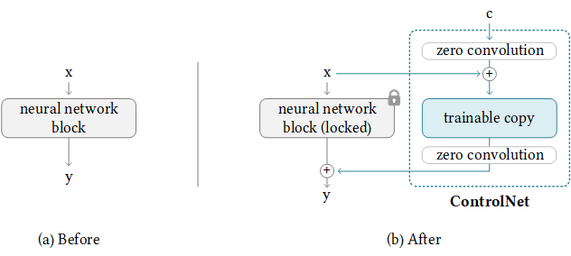
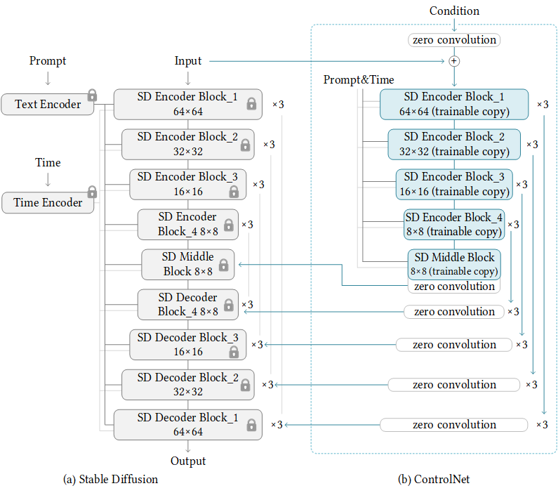
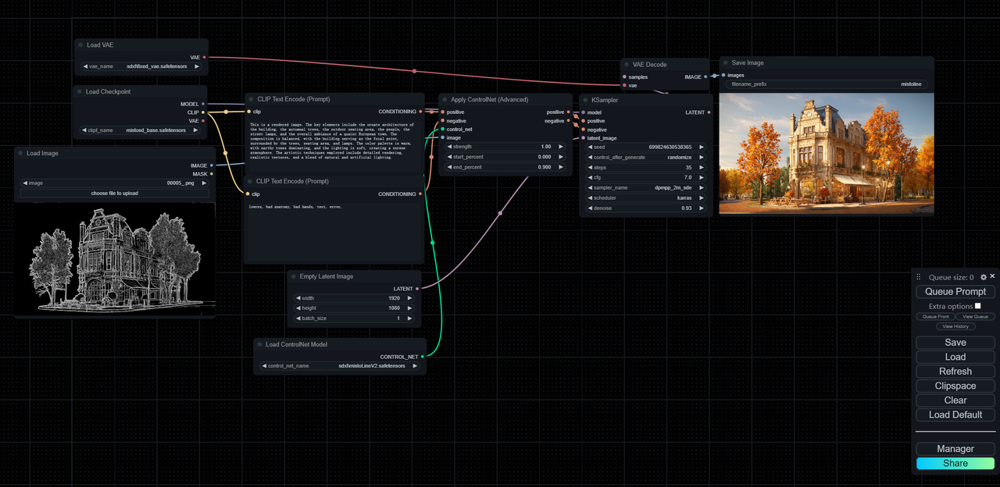

# MistoLine
 
## Control Every Line!
  
You can download the model here: [HuggingFace Repo](https://huggingface.co/TheMistoAI/MistoLine)  

**MistoLine: A Versatile and Robust SDXL-ControlNet Model for Adaptable Line Art Conditioning.**  

MistoLine is an SDXL-ControlNet model that can adapt to any type of line art input, demonstrating high accuracy and excellent stability. It can generate  high-quality images (with a short side greater than 1024px) based on user-provided line art of various types, including hand-drawn sketches, different  ControlNet line preprocessors, and model-generated outlines. MistoLine eliminates the need to select different ControlNet models for different line  preprocessors, as it exhibits strong generalization capabilities across diverse line art conditions.  

We developed MistoLine by employing a novel line preprocessing algorithm (**Anyline**) and retraining the ControlNet model based on the Unet of stabilityai/  stable-diffusion-xl-base-1.0, along with innovations in large model training engineering. MistoLine showcases superior performance across
different types of line art inputs, surpassing existing ControlNet models in terms of detail restoration, prompt alignment, and stability, particularly in more complex  scenarios.  

MistoLine maintains consistency with the ControlNet architecture released by @lllyasviel, as illustrated in the following schematic diagram:  
  
  
*reference：https://github.com/lllyasviel/ControlNet*  

More information about ControlNet can be found in the following references:  
https://github.com/lllyasviel/ControlNet  
https://huggingface.co/docs/diffusers/main/en/api/pipelines/controlnet_sdxl  

The model is compatible with most SDXL models, except for PlaygroundV2.5 and CosXL. It can be used in conjunction with LCM and other ControlNet models. 
We have open-sourced the corresponding model weight files for non-commercial use by individual users.

## Apply with Different Line Preprocessors
  

## Compere with Other Controlnets
  

## Application Examples

### Sketch Rendering
*The following case only utilized MistoLine as the controlnet：*
  

### Model Rendering
*The following case only utilized Anyline as the preprocessor and MistoLine as the controlnet.*


## ComfyUI Recommended Parameters
```
sampler steps:30
CFG:7.0
sampler_name:dpmpp_2m_sde
scheduler:karras
denoise:0.93
controlnet_strength:1.0
stargt_percent:0.0
end_percent:0.9
```

## Checkpoints
* mistoLine_rank256.safetensors : General usage version, for ComfyUI and AUTOMATIC1111-WebUI.  
* mistoLine_fp16.safetensors : FP16 weights, for ComfyUI and AUTOMATIC1111-WebUI.  

## ComfyUI Usage


## 中国（大陆地区）便捷下载地址： 
链接：https://pan.baidu.com/s/1DbZWmGJ40Uzr3Iz9RNBG_w?pwd=8mzs  
提取码：8mzs  

## Citation
```
@misc{
      title={Adding Conditional Control to Text-to-Image Diffusion Models}, 
      author={Lvmin Zhang, Anyi Rao, Maneesh Agrawala},
      year={2023},
      eprint={2302.05543},
      archivePrefix={arXiv},
      primaryClass={cs.CV}
}
```
