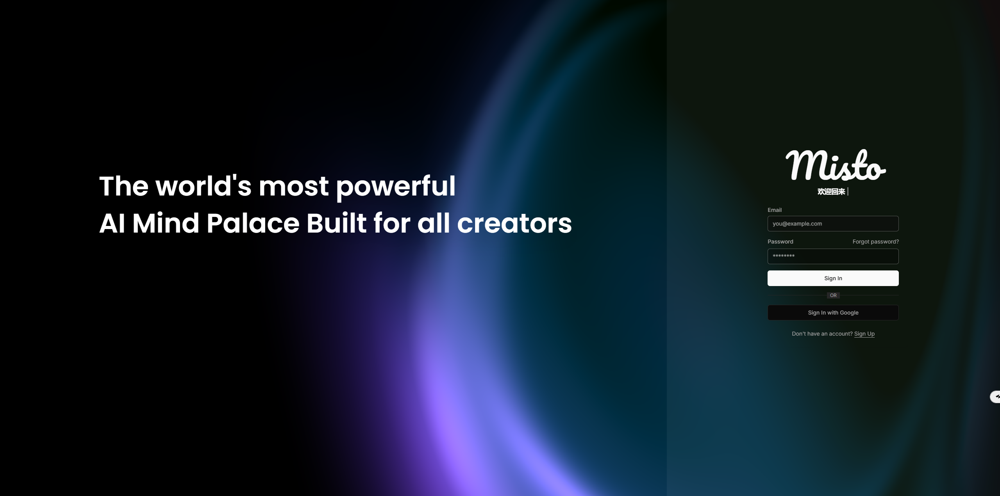

# New Update!
We have just launched our latest product, Misto.
The most powerful AI Mind Palace built for all designers.
Warmly welcome everyone to try it out.

### Website here: https://themisto.ai/

  

# MistoLine

## Control Every Line!

  
You can download the model here: [HuggingFace Repo](https://huggingface.co/TheMistoAI/MistoLine)

**MistoLine: A Versatile and Robust SDXL-ControlNet Model for Adaptable Line Art Conditioning.**

MistoLine is an SDXL-ControlNet model that can adapt to any type of line art input, demonstrating high accuracy and excellent stability. It can generate high-quality images (with a short side greater than 1024px) based on user-provided line art of various types, including hand-drawn sketches, different ControlNet line preprocessors, and model-generated outlines. MistoLine eliminates the need to select different ControlNet models for different line preprocessors, as it exhibits strong generalization capabilities across diverse line art conditions.

We developed MistoLine by employing a novel line preprocessing algorithm **[Anyline](https://github.com/TheMistoAI/ComfyUI-Anyline)** and retraining the ControlNet model based on the Unet of stabilityai/ stable-diffusion-xl-base-1.0, along with innovations in large model training engineering. MistoLine showcases superior performance across
different types of line art inputs, surpassing existing ControlNet models in terms of detail restoration, prompt alignment, and stability, particularly in more complex scenarios.

MistoLine maintains consistency with the ControlNet architecture released by @lllyasviel, as illustrated in the following schematic diagram:  
  
  
_reference：https://github.com/lllyasviel/ControlNet_

More information about ControlNet can be found in the following references:  
https://github.com/lllyasviel/ControlNet  
https://huggingface.co/docs/diffusers/main/en/api/pipelines/controlnet_sdxl

The model is compatible with most SDXL models, except for PlaygroundV2.5, CosXL, and SDXL-Lightning(maybe). It can be used in conjunction with LCM and other ControlNet models.

The following usage of this model is not allowed:

- Violating laws and regulations
- Harming or exploiting minors
- Creating and spreading false information
- Infringing on others' privacy
- Defaming or harassing others
- Automated decision-making that harms others' legal rights
- Discrimination based on social behavior or personal characteristics
- Exploiting the vulnerabilities of specific groups to mislead their behavior
- Discrimination based on legally protected characteristics
- Providing medical advice and diagnostic results
- Improperly generating and using information for purposes such as law enforcement and immigration

The model output is not censored and the authors do not endorse the opinions in the generated content. Use at your own risk.

## If you use or distribute this model for commercial purposes, you must comply with the following conditions:

1. Clearly acknowledge the contribution of TheMisto.ai to this model in the documentation, website, or other prominent and visible locations of your product.  
   Example: "This product uses the MistoLine-SDXL-ControlNet developed by TheMisto.ai."
2. If your product includes about screens, readme files, or other similar display areas, you must include the above attribution information in those areas.
3. If your product does not have the aforementioned areas, you must include the attribution information in other reasonable locations within the product to ensure that end-users can notice it.
4. You must not imply in any way that TheMisto.ai endorses or promotes your product. The use of the attribution information is solely to indicate the origin of this model.  
   If you have any questions about how to provide attribution in specific cases, please contact info@themisto.ai.

## 署名条款

如果您在商业用途中使用或分发本模型,您必须满足以下条件:

1. 在产品的文档,网站,或其他主要可见位置,明确提及 TheMisto.ai 对本软件的贡献。  
   示例: "本产品使用了 TheMisto.ai 开发的 MistoLine-SDXL-ControlNet。"
2. 如果您的产品包含有关屏幕,说明文件,或其他类似的显示区域,您必须在这些区域中包含上述署名信息。
3. 如果您的产品没有上述区域,您必须在产品的其他合理位置包含署名信息,以确保最终用户能够注意到。
4. 您不得以任何方式暗示 TheMisto.ai 为您的产品背书或促销。署名信息的使用仅用于表明本模型的来源。  
   如果您对如何在特定情况下提供署名有任何疑问,请联系info@themisto.ai。

## Apply with Different Line Preprocessors


## Compere with Other Controlnets


## Application Examples

### Sketch Rendering

_The following case only utilized MistoLine as the controlnet：_


### Model Rendering

_The following case only utilized Anyline as the preprocessor and MistoLine as the controlnet._


## ComfyUI Recommended Parameters

```
sampler steps:30
CFG:7.0
sampler_name:dpmpp_2m_sde
scheduler:karras
denoise:0.93
controlnet_strength:1.0
stargt_percent:0.0
end_percent:0.9
```

## Checkpoints

- mistoLine_rank256.safetensors : General usage version, for ComfyUI and AUTOMATIC1111-WebUI.
- mistoLine_fp16.safetensors : FP16 weights, for ComfyUI and AUTOMATIC1111-WebUI.

### !!!mistoLine_rank256.safetensors better than mistoLine_fp16.safetensors

### !!!mistoLine_rank256.safetensors 表现更加出色！！

## ComfyUI Usage

The standard workflow using Anyline+Mistoline in SDXL is as follows  


You can download this workflow JSON here: [ComfyUI Workflow](Anyline%2BMistoLine_ComfyUI_workflow.json)

## 中国（大陆地区）便捷下载地址：

链接：https://pan.baidu.com/s/1DbZWmGJ40Uzr3Iz9RNBG_w?pwd=8mzs  
提取码：8mzs

## Citation

```
@misc{
      title={Adding Conditional Control to Text-to-Image Diffusion Models},
      author={Lvmin Zhang, Anyi Rao, Maneesh Agrawala},
      year={2023},
      eprint={2302.05543},
      archivePrefix={arXiv},
      primaryClass={cs.CV}
}
```
